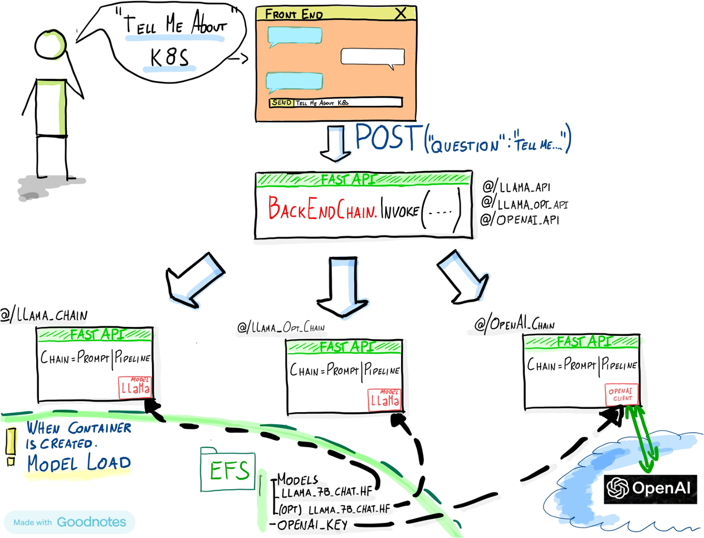
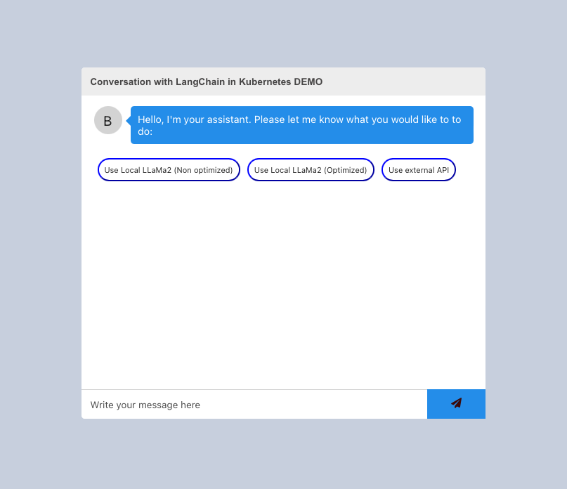

# DEMO for deploying a QA chatbot in Kubernetes

Welcome to the repository dedicated to deploying a QA chatbot in Kubernetes utilizing open-source tools.

This repository aims to provide a comprehensive, step-by-step guide for implementing a chatbot on Kubernetes using open-source tools. This document will walk you through each stage, from container creation to launching a Kubernetes server.

As we are employing local models, our practical setup will rely on AWS File Server (EFS) and Container Registry (ECR). However, you can substitute these with your preferred file server and Kubernetes cluster provider.

# Description of the architecture

The architecture for this implementation is outlined below:



1. **Front End**:
   The front end is built using `react-chatbot-kit`, a versatile and customizable chatbot framework. You can find more information about `react-chatbot-kit` [here](https://www.npmjs.com/package/react-chatbot-kit).

1. **Front End for different models**:
   Since we will be using multiple LLMs, we would need to create one LLM 'front-end' to centralize all the requests and then send them to where each particular model is instantiated.

2. **Models**:
   This implementation relies on three different models:
   - **Local LLaMa2_7B**: llama-2-7b-chat-hf model downloaded from Hugging Face (https://huggingface.co/meta-llama/Llama-2-7b-chat-hf)  and stored on a file server.
   - **Local Optimized LLaMa2_7B**: An optimized version of the LLaMa2_7B model created using ITREX (details on optimization in the "How was the optimization done?" section). This optimized model is also stored on a file server (EFS).
   - **External Paid API**: OpenAI's paid API.

# Step by step

The proposed architecture serves as a foundational guide for deploying multiple Language Model Models (LLMs) in a Kubernetes environment.

Feel free to explore the provided resources and adapt the implementation to your specific use case.

Let's bring your chatbot to life on Kubernetes!


## 1. Clone the repository
```bash
git clone https://github.com/ezelanza/LangChain-in-Kubernetes.git
```

## 2. Create Containers

After cloning the project, navigate to each folder to create each container (docker). There is a Dockerfile in each folder with the instructions. In this case, we will BUILD it to run in an Intel processor, but you should change (--platform linux/amd64) it according to your platform.

*NOTE : BE SURE TO HAVE YOUR DOCKER ENGINE INSTALLED* Refer to https://www.docker.com 

Create REACT front end container
```{python}
    cd 1__Front_End 
    docker build --platform linux/amd64 -t front_end:latest .
```
Create Python Front_end_LLM container
```{python}
    cd 2__Models_FE
    docker build --platform linux/amd64 -t llms_front_end:latest .
```

Create Python LLM container for each model (In this example for LlaMa7B non optimized).
*Note : Repeat this step to all the containers you'd like to create*

```{python}
    cd 3__Local_Models/LLAMA-NON 
    docker build --platform linux/amd64 -t llama7b-non-optimized:latest .
```
You should now be able to see both containers on your environment.
```{python}
    docker images
```

## 3. Push containers to the registry
Your containers need to reside somewhere accessible so that they can be downloaded when the Kubernetes cluster is created.

There are several options available, including Amazon ECR and Docker HUB.

In this case, we will use Docker Hub. Refer to Docker documentation based on the operating system you're using to get instructions on creating your repository.

```
docker login
```
Tag your container (For example for front_end container)
```
docker tag front_end:1.0 <username>/front_end:1.0
```
And finally push it to your repository
```
docker push <username>/front_end:1.0
```

## 4. Download/Optimzize models
For this example we will be using 3 different types of models. Follow "How to download a model from Hugging Face?" below section in order to download the models.

- **LlaMa2-7b-chat-hf Model** : Follow the instructions to locally download the model from hugging face and store it in your File server, in this demo will see that each local container loads de model from the mounted file server on the container. 
```
model_path="/efs_mounted/Models/llama-2-7b-chat-hf"    # Modify it accordly to your file server mount path defined on the deployment.yaml file.
```
- **OPTIMIZED : LlaMa2-7b-chat-hf Model** : Follow the Apendix section "How was the optimization done?" to perform the optimization. 
- **OpenAI API-GPT3.5/4** : API....

## 5. Set up your kubernetes enviroment
You can deploy your cluster on any cloud provider, or you can visit cloud.intel.com to set up your environment on the latest Intel Xeon or Gaudi generations. Follow this guide to connect to your environment :  https://console.cloud.intel.com/docs/guides/k8s_guide.html.

The configuration files for the cluster are the following:
###    - **Configuration files (yaml)**: 
   - **deployment.yaml**: This yaml file contains the configuration to perform deployments, and creates the services to each of them and set environments to be used:
        - **ServiceAccount**: The ServiceAccount and roles are created specifically to capture the IP address assigned to each BackEnd LLM service. This information is necessary for the LLM back_end to effectively forward incoming requests. This setup is exclusively utilized by the llm_front_end to facilitate the forwarding process for each request.
        - **VolumeMounts**: As previously mentioned, each local LLM will be stored on a file server to be consumed when pods containing local models are launched. VolumeMounts are utilized to mount the file server within the pod. Please adjust the configuration according to your file server setup.
        - **Image Containers**: URL of where containers were pushed.
        - **Worker assigment**: This demonstration utilizes two distinct worker groups, namely "light" and "intensive". Each deployment is associated with a nodeAffinity that corresponds to the anticipated load requirements. In this demo setup, it's configured to utilize EKS node groups for managing the worker nodes.
    - **Persistent Volume/Claim**:

   - **ingress.yaml**: This file configures the ingress rules for the NGNIX controller.
   --**APIS**
   --**Front_end**

#export HTTPS_PROXY=http://proxy-chain.intel.com:912

### 5.1 Install Ngnix

NGNIX....
```
helm upgrade --install ingress-nginx ingress-nginx --repo https://kubernetes.github.io/ingress-nginx --namespace ingress-nginx --create-namespace --set controller.hostPort.enabled=true
```

### 5.2 Deploy services

### 5.3 Deployment
This is where you create all the containers and te configuration descripted on the .yaml file

### 5.4 LET'S ACCESS! 
The services are exposed to Port:80, for demo purposes we will be forwarding them to our localhost:8000
```
kubectl port-forward -n kube-system svc/ingress-nginx-controller 8000:80
```
Goto http://localhost:8000/



# Apendix

# How to download a model from Hugging Face?


# How was the optimization done?

We performed a weightonlyoptimization thanks to Intel Extensions for transformers. LlaMa2-7b-hf will be used and this step will help to reduce the size of the model from ~30GB to ~7GB. Thanks to techniques like quantization.

These are the steps you should follow in order to replicate it.

Before starting you should go ahead and clone the repository:
```
git clone https://github.com/intel/intel-extension-for-transformers
```

In our case, we will be using a new conda environment (Refer to xxx to install conda in your env)

```
conda create -n langchain python=3.10
```


### 1. Quantize the model
In order to have a model quantized we need to install ITREX

```
cd intel-extension-for-transformers 
pip install -r requirements.txt
python setup.py install

```
Once ITREX is installed you should refer to the folder where each different optimization is performed and install their requirements. In this case, we will be using Text-generation folder to quantize a Hugging Face model, you can navigate to other formats like Pytorch/TensorFlow:

```
cd examples/huggingface/pytorch/text-generation/quantization
pip install -r requirements.txt
```
We are now ready to perform the quantization. Since ITREX uses gcp libraries you might need to expose

```
find $CONDA_PREFIX | grep libstdc++.so.6
export LD_PRELOAD=/home/tensorflow/miniconda3/envs/langchain/lib/libstdc++.so.6

```
Let's perform the quantization!
The folder has a script (run_generation.py) which downloads the model from HuggingFace(In this case we will be using https://huggingface.co/meta-llama/Llama-2-7b-chat-hf), perform the quantization and saves the model in the same Hugging Face format for future inference.

```
python run_generation.py --model meta-llama/Llama-2-7b-hf  --output_dir ./saved_llama     --woq

```
We now have the model quantized with the size reduced. It's now ready to be used as you normally use in a Hugging Face Pipeline.

```
from langchain_community.llms.huggingface_pipeline import HuggingFacePipeline

#Install ITREX in order to use the API
from intel_extension_for_transformers.transformers import AutoModelForCausalLM

model_path = “path/to/model/”

optimized_model = AutoModelForCausalLM.from_pretrained(model_path,use_neural_speed=False,)

local_tokenizer=LlamaTokenizer.from_pretrained(model_path)

pipe= pipeline(task="text-generation", model=optimized_model, tokenizer=local_tokenizer,trust_remote_code=True, max_new_tokens=100, repetition_penalty=1.1, 	 model_kwargs={"max_length": 1200, "temperature": 0.01}) 

llm_pipeline = HuggingFacePipeline(pipeline=pipe)

```


